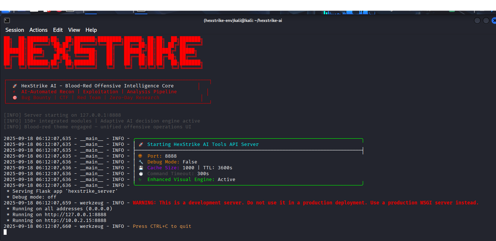
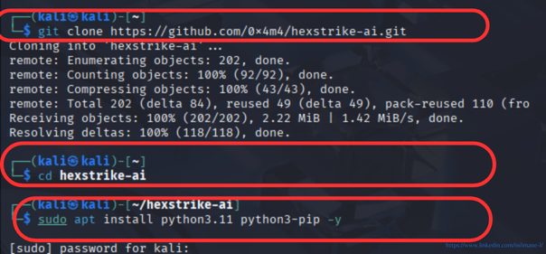
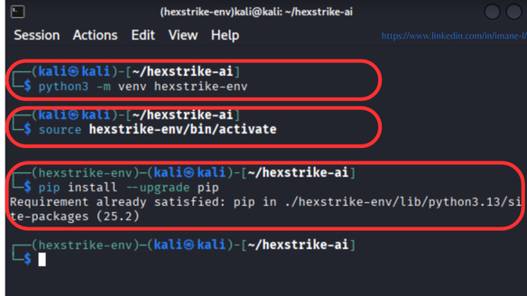
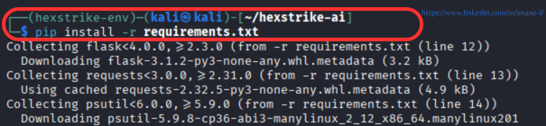
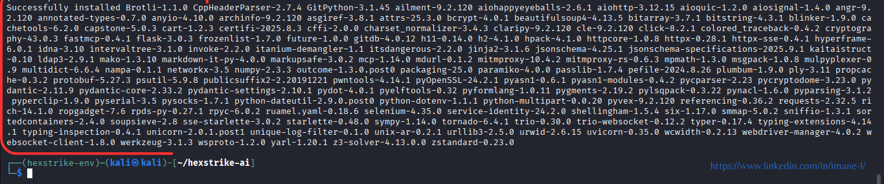
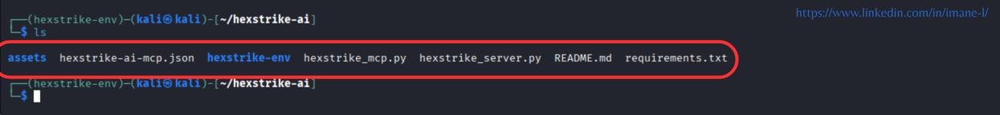
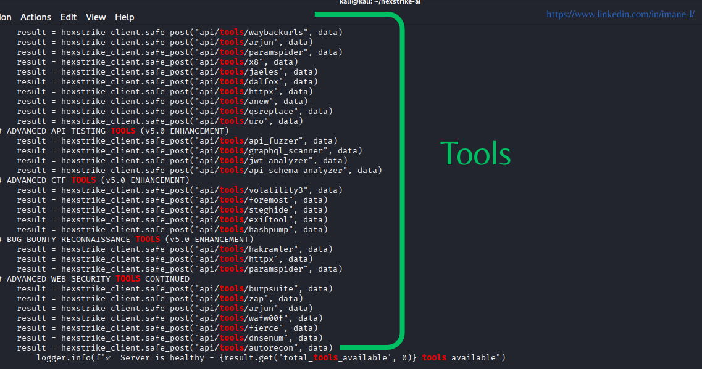
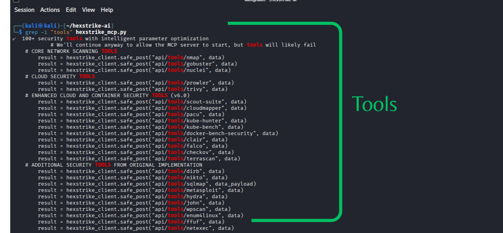
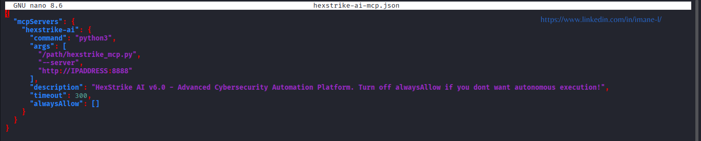

# HexStrike AI v6.0 🚀

(https://raw.githubusercontent.com/0x4m4/hexstrike-ai/main/assets/logo.png) <!-- Puedes reemplazar con la URL de la imagen oficial -->

HexStrike AI v6.0 es una **plataforma de seguridad ofensiva** que combina **herramientas profesionales** con **agentes de IA autónomos** para ofrecer pruebas de seguridad completas.  

---

## 🔹 Características principales

- 🤖 **Agentes autónomos especializados** para diferentes dominios de seguridad.  
- 🛠️ **Más de 150 herramientas integradas**: Nmap, Burp Suite, Metasploit, Ghidra, y más.  
- ⏱️ **Automatización avanzada**: pruebas de pentesting, análisis de aplicaciones web, memoria, binarios y CTF.  
- 🧩 **Inteligencia de vulnerabilidades**: análisis en tiempo real de CVEs y generación de exploits.  
- 💻 **Automatización de Bug Bounty**: optimiza la búsqueda y explotación de vulnerabilidades.  

---

## 🔹 Por qué es relevante

- Reducción del tiempo de explotación de vulnerabilidades de **días a minutos**.  
- Mayor eficiencia en **resolución de CTFs y pruebas de seguridad**.  
- Automatización segura que **requiere supervisión humana** para interpretar resultados y tomar decisiones.  

---

## 🔹 Cómo lo descargué y probé

1. Cloné el repositorio oficial:
```bash
git clone https://github.com/0x4m4/hexstrike-ai.git



```

2. Entré en el directorio y revisé los archivos de instalación.



3. Seguí los pasos del tutorial oficial para instalar dependencias y ejecutar los agentes de IA.
















4. Probé ejemplos de pentesting automatizado, análisis de aplicaciones web y resolución de CTFs para verificar su funcionamiento.

